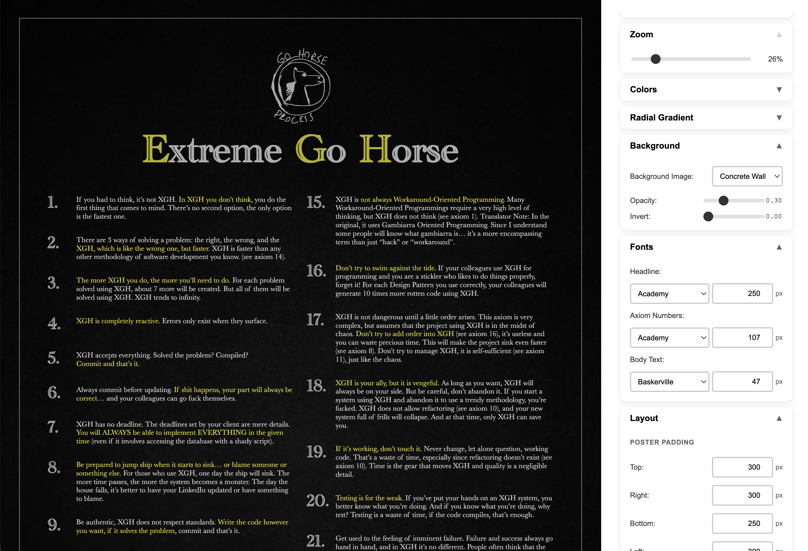
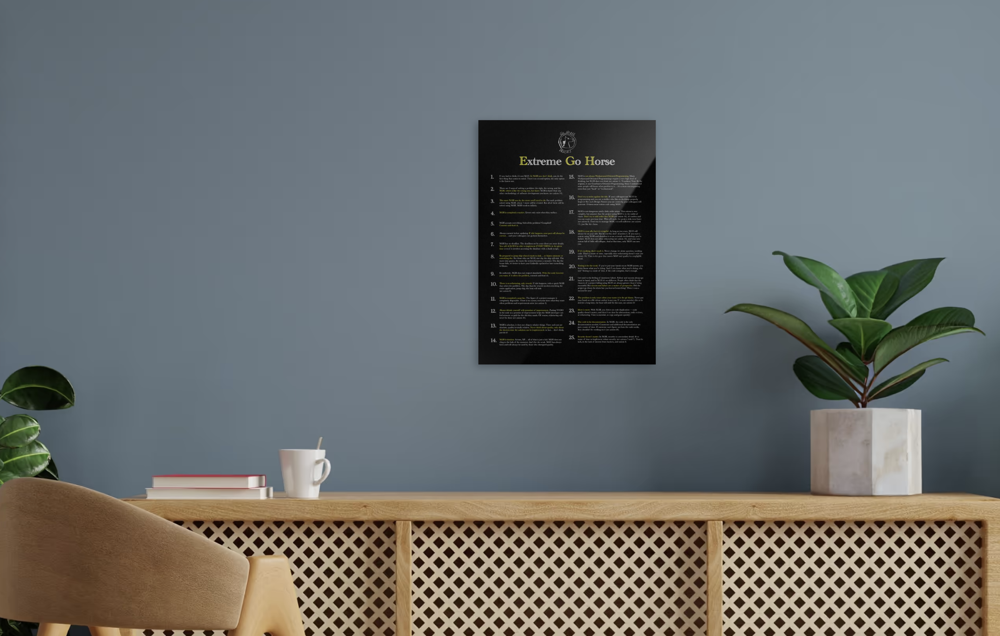

# Extreme Go Horse Poster Configurator

Dimentions: 3780px x 5292px (1 x 1.4), made for Displate M  
https://displate.com/custom-displate

Right click DOM Node -> "Capture node screenshot" (make sure to have 100% zoom)  
I saved some images inside the results directory.

**_Live Configurator here ->_** https://paulnaber.github.io/xgh-poster/  
**_Displate link_** -> https://displate.com/artist/paulnaber?art=63dfad5946daf

> Of course this project is fully vibecoded using the XGH axioms in mind!

## Showcases

### Why is there no tests in this project?

see axiom 20.

### Why is there no documentation?

see axiom 24.
